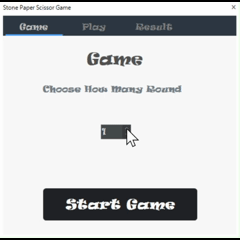

# 🪨 Stone Paper Scissor Game — WinForms Edition

🎮 **A fun and interactive Stone–Paper–Scissor game built using C# and .NET Framework 4.8.1 (WinForms).**

This project demonstrates the use of:
- Enums and event handling in C#
- Tab-based UI navigation
- Asynchronous tasks (async/await)
- Randomized computer logic
- Dynamic UI updates in real time

---

## 🧩 Features
- 🪨 Stone / 📄 Paper / ✂️ Scissor choices for the player  
- 💻 Random computer choice per round  
- 🕐 Adjustable number of rounds  
- 🧠 Auto-calculated winner per round  
- 🏆 Final result tab with total wins, draws, and overall winner  
- 💫 Animated waiting indicator for computer turn  

---

## ⚙️ Technologies Used
- **Language:** C#  
- **Framework:** .NET Framework 4.8.1  
- **UI Library:** [ReaLTaiizor Controls](https://github.com/aloneguid/ReaLTaiizor)  
- **IDE:** Visual Studio  

---

## 🎬 Project Video


```markdown


---

## 📜 License
This project is released under the **MIT License** — feel free to use and modify it.
